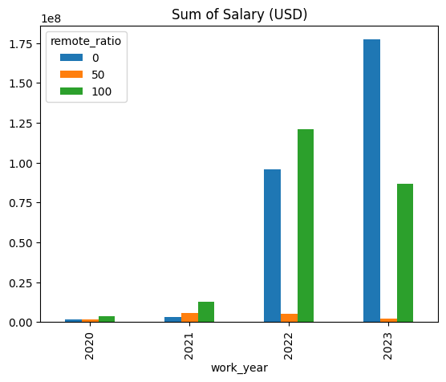
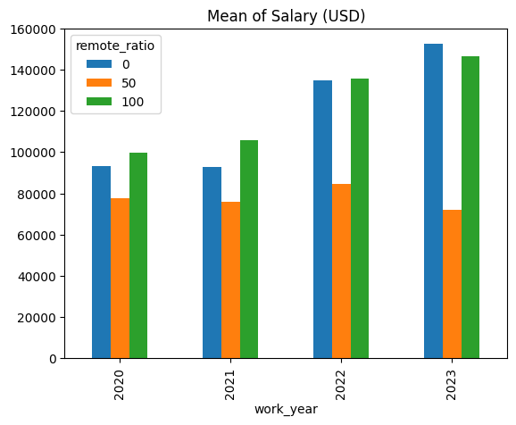
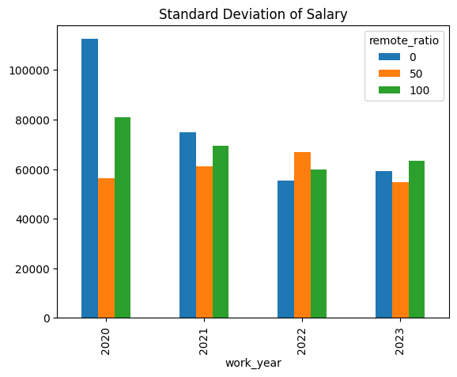
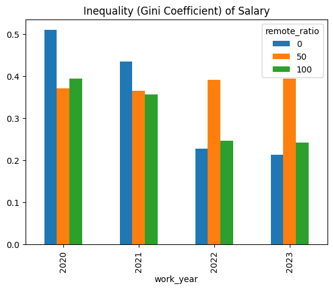
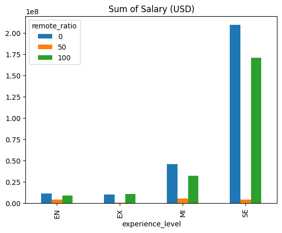
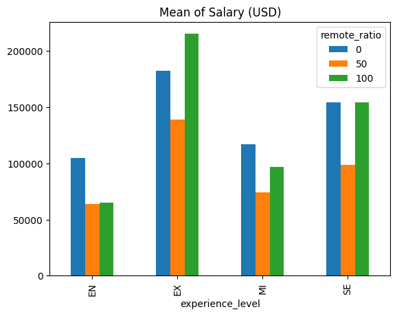
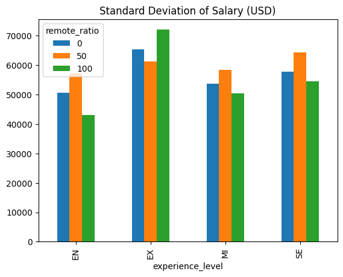
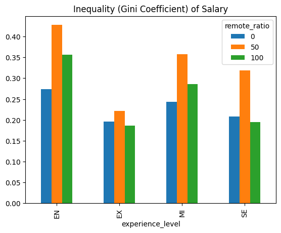
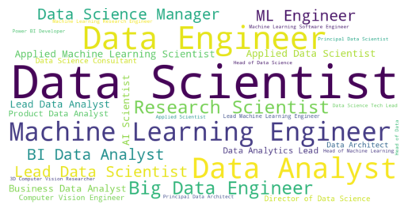

# EDA-Data-Science-Salary
## Exploratory Analysis of Data Science Salaries (2020-2023)
### Salaries of Different Data Science Fields in the Data Science Domain

**Source:** https://www.kaggle.com/datasets/arnabchaki/data-science-salaries-2023

Data Science Job Salaries Dataset contains **11 columns**, each are:

1. **work_year:** The year the salary was paid.
2. **experience_level:** The experience level in the job during the year
3. **employment_type:** The type of employment for the role
4. **job_title:** The role worked in during the year.
5. **salary:** The total gross salary amount paid.
6. **salary_currency:** The currency of the salary paid as an ISO 4217 currency code.
7. **salaryinusd:** The salary in USD
8. **employee_residence:** Employee's primary country of residence in during the work year as an ISO 3166 country code.
9. **remote_ratio:** The overall amount of work done remotely
10. **company_location:** The country of the employer's main office or contracting branch
11. **company_size:** The median number of people that worked for the company during the year

---

## Some results

### Temporal Analysis of Salary (USD) and Remote Ratio

### Analysis of Salary (USD) and Remote Ratio per Experience Level

### Word Cloud Visualization of Job Titles in Data Science with higher salaries

